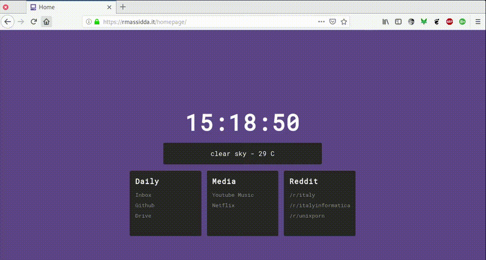

# moderation



Firefox extension, potentially working on Chrom{ium,e}, that impose daily time limits on the visit of certain websites.

The limits are configurable in a CSV style in *about:addons*, as in:

```
youtube.com,600
twitter.com,300
news.google.com,120
reddit.com,600
```
